# AdGuardHome 管理系统 (ADGHM)

[](https://www.python.org/downloads/)
[](https://flask.palletsprojects.com/)
[](LICENSE)

一个专为简化 AdGuardHome 管理而设计的 Web 应用程序，支持多用户管理、自动化域名解析、AI智能分析等功能。

## 🌟 主要功能

### 🔐 用户管理
- **多用户支持**：每个用户拥有独立的账户和客户端管理权限
- **权限分级**：支持管理员和普通用户两种角色
- **用户注册**：支持用户自主注册，首个注册用户自动成为管理员
- **密码管理**：安全的密码哈希存储和验证机制

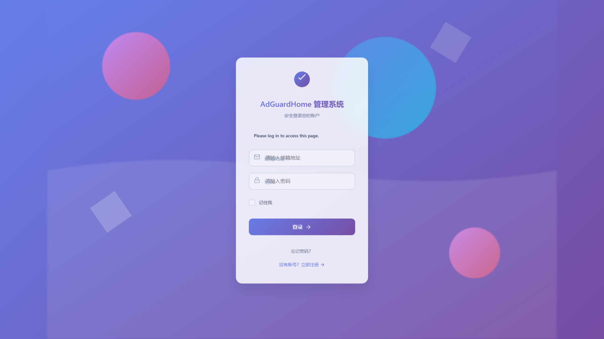
*登录页面 - 美观的动画背景和现代化的登录界面*

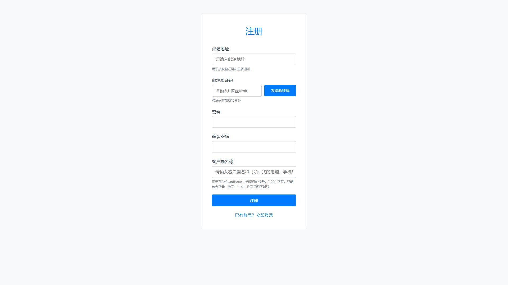
*注册页面 - 用户友好的注册表单*

### 🖥️ 客户端管理
- **客户端创建**：支持创建和管理 AdGuardHome 客户端
- **客户端配置**：可配置过滤规则、安全浏览、家长控制等设置
- **批量操作**：支持批量管理多个客户端
- **状态监控**：实时显示客户端状态和统计信息

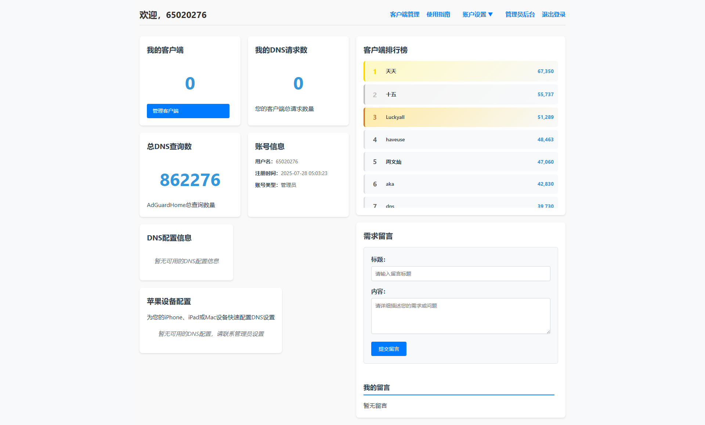
*用户主页 - 显示用户统计信息和DNS配置*

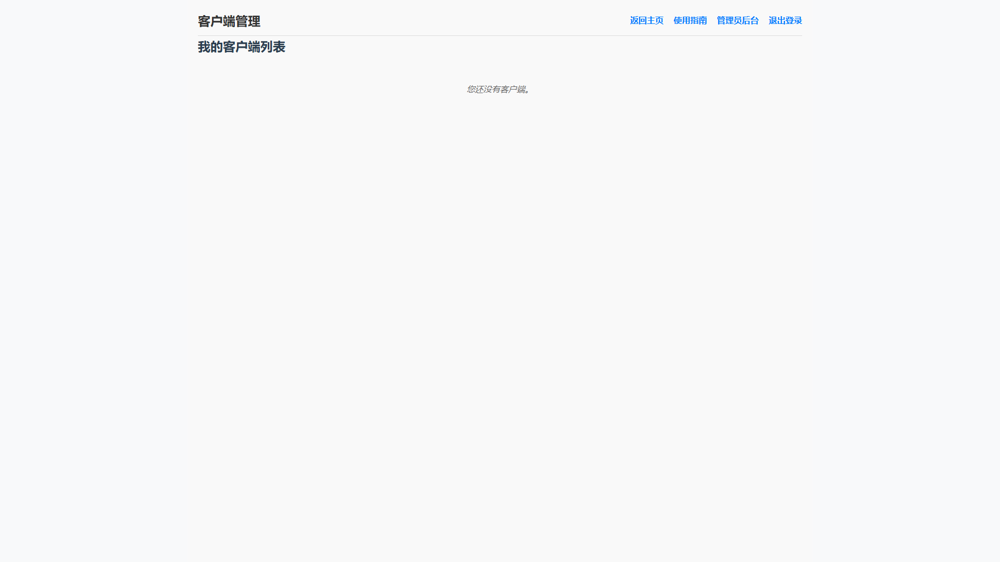
*客户端管理页面 - 管理用户的AdGuardHome客户端*

### 🌐 域名解析管理
- **自动化域名解析**：系统自动检测 IP 变化并更新域名解析记录
- **双栈支持**：同时支持 IPv4 和 IPv6 地址解析
- **阿里云集成**：与阿里云 DNS 解析服务深度集成
- **动态更新**：支持动态 IP 地址的自动更新

### 📊 查询日志增强
- **高级搜索**：支持多条件过滤和时间范围搜索
- **日志导出**：支持 CSV 和 JSON 格式的日志导出
- **趋势分析**：提供 DNS 查询趋势分析报告
- **可视化图表**：直观的统计图表展示

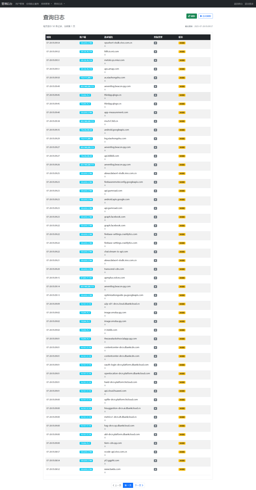
*查询日志页面 - 查看DNS查询记录*

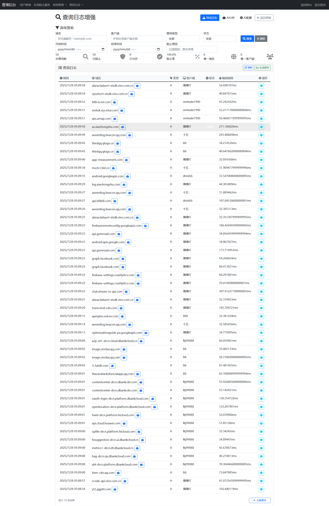
*增强查询日志页面 - 高级搜索和分析功能*

### 🤖 AI 智能分析
- **DeepSeek 集成**：集成 DeepSeek AI 进行智能域名分析
- **威胁识别**：自动识别广告、追踪器、恶意软件等威胁
- **智能推荐**：基于 AI 分析结果提供阻止建议
- **批量分析**：支持批量分析多个域名
- **审核流程**：管理员可审核 AI 分析结果并采取行动

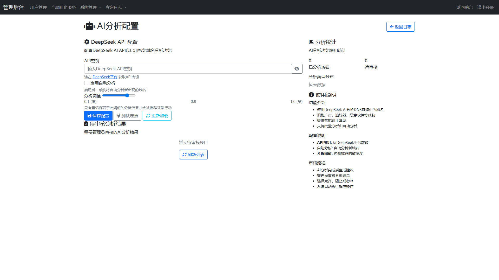
*AI分析配置页面 - 配置DeepSeek AI分析功能*

### 📧 邮件服务
- **邮件验证**：支持邮箱验证功能
- **密码重置**：通过邮件重置密码
- **通知服务**：重要操作的通知邮件发送

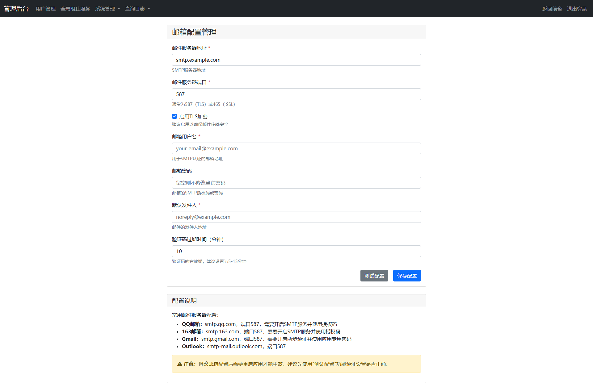
*邮件配置页面 - 配置SMTP邮件服务器*

### 🔧 系统配置
- **AdGuardHome 配置**：管理 AdGuardHome API 连接
- **DNS 配置**：支持 DNS-over-QUIC、DNS-over-TLS、DNS-over-HTTPS 配置
- **邮件配置**：SMTP 邮件服务器配置
- **系统设置**：各种系统参数配置

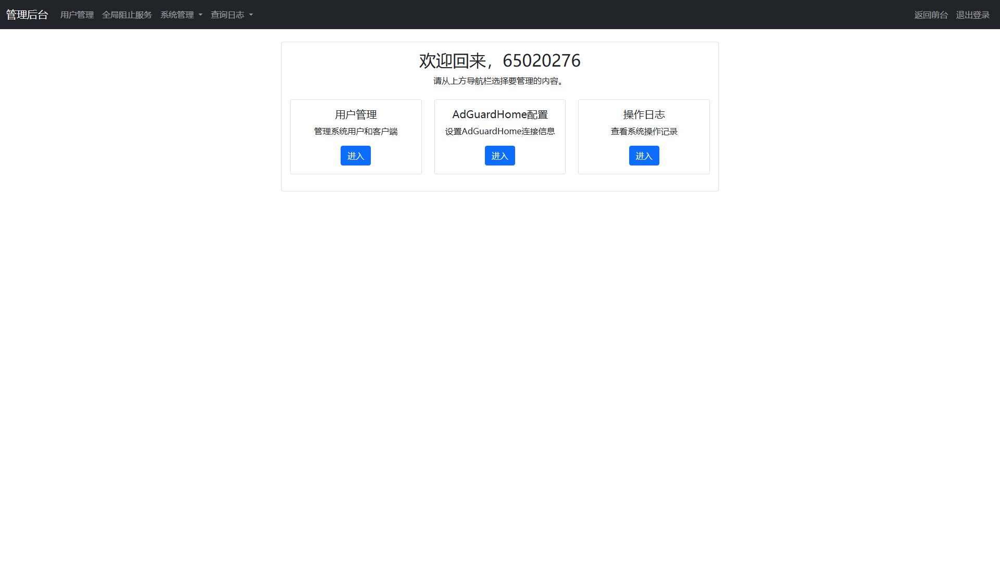
*管理员后台主页 - 系统管理入口*

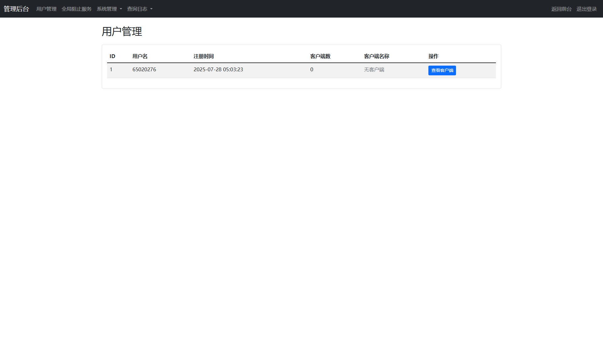
*用户管理页面 - 管理系统用户*

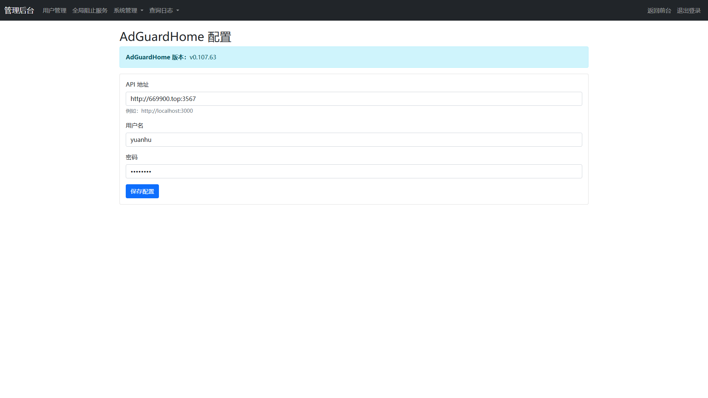
*AdGuardHome配置页面 - 配置API连接*

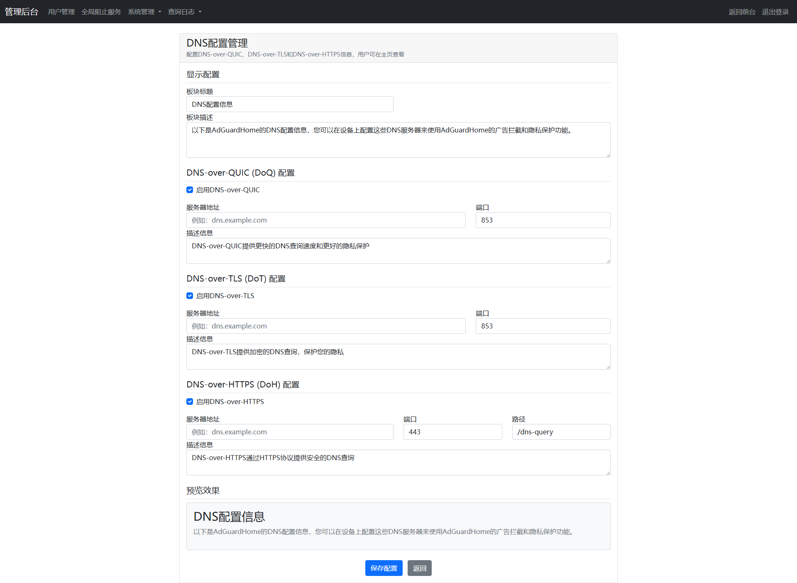
*DNS配置页面 - 配置DNS-over-QUIC/TLS/HTTPS*

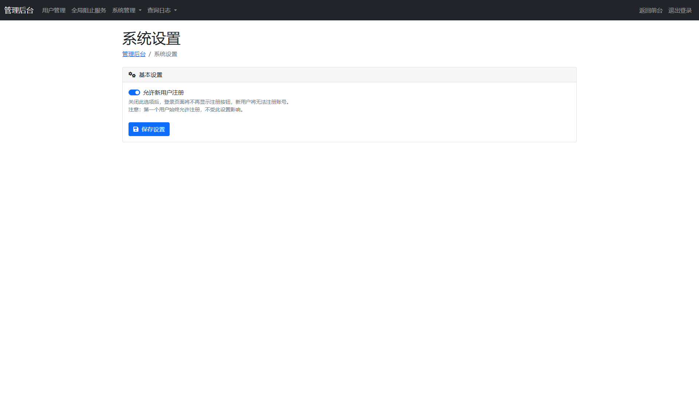
*系统配置页面 - 系统参数设置*

### 📋 日志和反馈管理
- **操作日志**：记录系统操作历史
- **反馈管理**：用户反馈处理
- **全局阻止服务**：管理全局阻止的服务列表

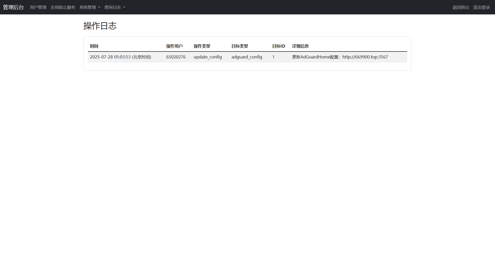
*操作日志页面 - 查看系统操作记录*

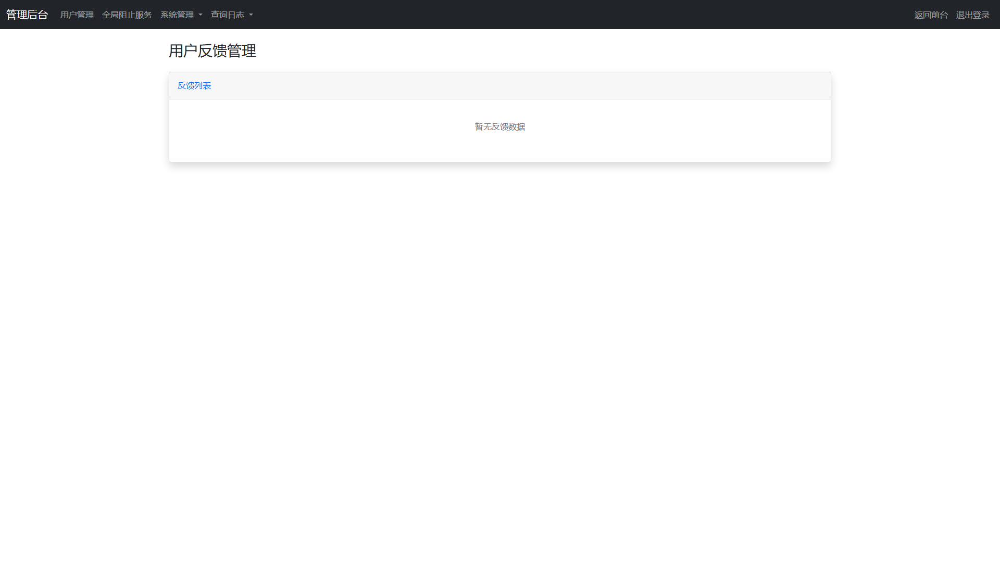
*反馈管理页面 - 处理用户反馈*


*全局阻止服务页面 - 管理全局阻止的服务*

### 📖 使用指南
- **详细文档**：提供完整的使用指南和帮助文档

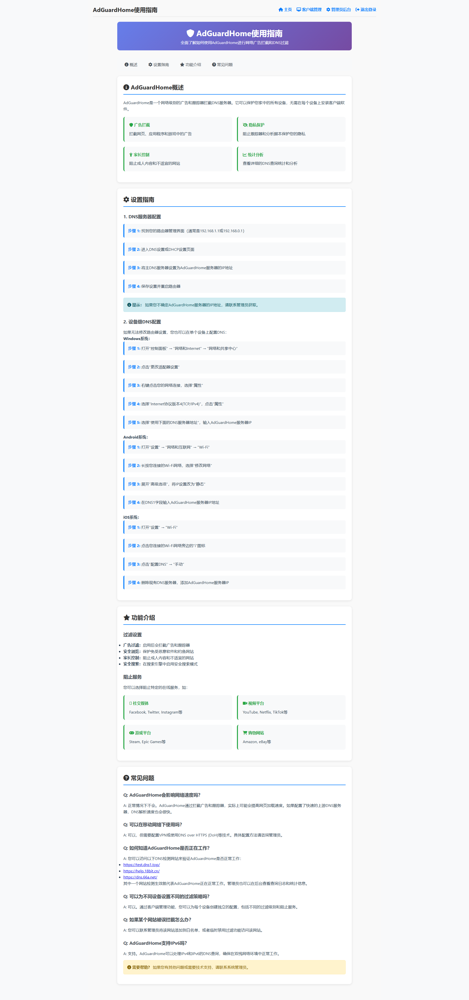
*使用指南页面 - 详细的使用说明和帮助文档*

## 🚀 快速开始

### 环境要求

- **Python**: 3.11 或更高版本
- **操作系统**: Linux、Windows、macOS
- **内存**: 至少 2GB RAM
- **存储**: 至少 1GB 可用空间

### 安装方式

#### Docker 部署（推荐）

```bash
# 克隆项目
git clone https://github.com/yourusername/adghm.git
cd adghm

# 创建环境变量文件
cat > .env << EOF
SECRET_KEY=your_random_secret_key
ADGUARD_API_BASE_URL=http://your-adguard-home:3000
ADGUARD_USERNAME=your_adguard_username
ADGUARD_PASSWORD=your_adguard_password
EOF

# 构建并启动容器
docker build -t adghm .
docker run -d -p 5000:5000 --name adghm --restart unless-stopped adghm
```

#### 手动部署

```bash
# 克隆项目
git clone https://github.com/yourusername/adghm.git
cd adghm

# 创建虚拟环境
python -m venv venv
source venv/bin/activate  # Linux/macOS
# 或 venv\Scripts\activate  # Windows

# 安装依赖
pip install -r requirements.txt

# 创建环境变量文件
cat > .env << EOF
SECRET_KEY=your_random_secret_key
ADGUARD_API_BASE_URL=http://your-adguard-home:3000
ADGUARD_USERNAME=your_adguard_username
ADGUARD_PASSWORD=your_adguard_password
EOF

# 启动应用
python run.py
```

### 初始配置

1. **访问系统**：打开浏览器访问 `http://localhost:5000`
2. **注册管理员**：注册第一个用户账号（将自动成为管理员）
3. **配置 AdGuardHome**：在管理员后台配置 AdGuardHome API 连接
4. **配置域名解析**：配置阿里云 AccessKey 和域名信息

## 📖 使用指南

### 用户操作

#### 注册和登录
- 访问系统首页进行注册
- 用户名必须是 6-12 位数字
- 首个注册用户自动成为管理员

#### 客户端管理
- 在个人主页创建和管理客户端
- 配置客户端名称和标识信息
- 查看客户端状态和统计信息

#### 域名映射
- 为客户端创建域名映射
- 系统自动生成子域名
- 支持 IPv4 和 IPv6 双栈解析

### 管理员操作

#### 系统配置
- **AdGuardHome 配置**：设置 API 连接信息
- **域名解析配置**：配置阿里云 AccessKey 和域名
- **邮件配置**：设置 SMTP 服务器信息
- **DNS 配置**：配置 DNS-over-QUIC/TLS/HTTPS

#### 用户管理
- 查看和管理所有用户
- 创建、编辑、删除用户账号
- 重置用户密码

#### 日志管理
- 查看系统操作日志
- 高级查询日志搜索
- 日志导出和分析

#### AI 分析管理
- 配置 DeepSeek API 密钥
- 管理 AI 分析结果
- 审核分析建议

## 🏗️ 技术架构

### 后端技术栈

- **Web 框架**: Flask 2.3.3
- **数据库**: SQLAlchemy + SQLite
- **认证**: Flask-Login
- **邮件**: Flask-Mail
- **任务调度**: Flask-APScheduler
- **AI 集成**: DeepSeek API

### 前端技术栈

- **模板引擎**: Jinja2
- **CSS 框架**: Bootstrap 4
- **图标**: Font Awesome
- **图表**: Chart.js
- **JavaScript**: jQuery

### 项目结构

```
adghm/
├── app/                    # 应用主目录
│   ├── admin/             # 管理员模块
│   ├── auth/              # 认证模块
│   ├── main/              # 主要视图
│   ├── models/            # 数据模型
│   ├── services/          # 服务层
│   ├── static/            # 静态文件
│   ├── templates/         # 模板文件
│   └── utils/             # 工具函数
├── docs/                  # 文档
├── migrations/            # 数据库迁移
├── openapi/              # API 文档
└── requirements.txt       # 依赖列表
```

## 🔧 配置说明

### 环境变量

| 变量名 | 说明 | 默认值 |
|--------|------|--------|
| `SECRET_KEY` | Flask 密钥 | 必填 |
| `ADGUARD_API_BASE_URL` | AdGuardHome API URL | 必填 |
| `ADGUARD_USERNAME` | AdGuardHome 用户名 | 必填 |
| `ADGUARD_PASSWORD` | AdGuardHome 密码 | 必填 |
| `MAIL_SERVER` | SMTP 服务器 | smtp.qq.com |
| `MAIL_PORT` | SMTP 端口 | 587 |
| `MAIL_USERNAME` | 邮箱用户名 | 必填 |
| `MAIL_PASSWORD` | 邮箱密码 | 必填 |

### 数据库配置

系统使用 SQLite 数据库，数据文件存储在 `instance/adghm.db`。

## 📊 功能特性

### 核心特性

- ✅ **多用户支持**：独立账户和权限管理
- ✅ **自动化域名解析**：动态 IP 自动更新
- ✅ **双栈支持**：IPv4 和 IPv6 地址解析
- ✅ **AI 智能分析**：DeepSeek AI 集成
- ✅ **高级日志管理**：搜索、导出、分析
- ✅ **邮件服务**：验证和通知功能
- ✅ **Docker 支持**：容器化部署
- ✅ **响应式设计**：移动端友好

### 安全特性

- 🔒 **密码加密**：使用 Werkzeug 安全哈希
- 🔒 **会话管理**：Flask-Login 安全会话
- 🔒 **权限控制**：基于角色的访问控制
- 🔒 **API 安全**：AdGuardHome API 认证
- 🔒 **数据保护**：敏感信息加密存储

## 🤝 贡献指南

欢迎贡献代码！请遵循以下步骤：

1. Fork 本项目
2. 创建功能分支 (`git checkout -b feature/AmazingFeature`)
3. 提交更改 (`git commit -m 'Add some AmazingFeature'`)
4. 推送到分支 (`git push origin feature/AmazingFeature`)
5. 创建 Pull Request

## 📝 更新日志

### v1.0.0 (2024-01-01)
- ✨ 新增多用户管理系统
- ✨ 新增自动化域名解析功能
- ✨ 新增 AI 智能分析功能
- ✨ 新增高级查询日志功能
- ✨ 新增邮件服务功能
- ✨ 新增 Docker 支持
- 🐛 修复多个已知问题
- 📚 完善文档和用户手册

## 📄 许可证

本项目采用 MIT 许可证 - 查看 [LICENSE](LICENSE) 文件了解详情。

## 📞 支持与反馈

如果您遇到问题或有建议，请通过以下方式联系我们：

- 📧 邮箱：1179736569@qq.com
- 🐛 [GitHub Issues](https://github.com/yourusername/adghm/issues)
- 📖 [项目文档](https://github.com/yourusername/adghm/docs)

## 🙏 致谢

感谢以下开源项目的支持：

- [Flask](https://flask.palletsprojects.com/) - Web 框架
- [AdGuardHome](https://adguardhome.adguard.com/) - DNS 服务器
- [Bootstrap](https://getbootstrap.com/) - CSS 框架
- [DeepSeek](https://platform.deepseek.com/) - AI 服务

---

⭐ 如果这个项目对您有帮助，请给我们一个星标！ 