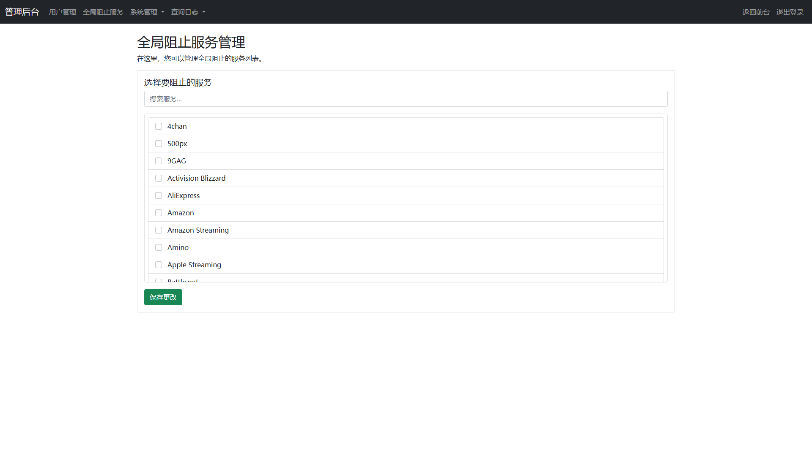

# AdGuardHome 管理系统 (ADGHM) | AdGuardHome Management System

[](https://www.python.org/downloads/)
[](https://flask.palletsprojects.com/)
[](https://www.sqlalchemy.org/)
[](LICENSE)
[](https://www.docker.com/)

[中文](#中文) | [English](#english)

---

## 中文

一个专为简化 AdGuardHome 管理而设计的现代化 Web 应用程序，支持多用户管理、AI智能分析、VIP会员系统、捐赠支持、OpenList对接等丰富功能。

---

## English

A modern web application designed to simplify AdGuardHome management, featuring multi-user support, AI intelligent analysis, VIP membership system, donation support, OpenList integration, and many other rich features.

## 🌟 主要功能 | Main Features

### 🔐 用户管理 | User Management
- **多用户支持** | **Multi-user Support**：每个用户拥有独立的账户和客户端管理权限 | Each user has independent account and client management permissions
- **权限分级** | **Role-based Access**：支持管理员和普通用户两种角色 | Support for administrator and regular user roles
- **用户注册** | **User Registration**：支持用户自主注册，首个注册用户自动成为管理员 | Support for user self-registration, first registered user automatically becomes administrator
- **密码管理** | **Password Management**：安全的密码哈希存储和验证机制 | Secure password hashing storage and verification mechanism
- **VIP会员系统** | **VIP Membership System**：支持VIP会员功能，提供高级特权 | Support VIP membership features with premium privileges


*登录页面 - 美观的动画背景和现代化的登录界面*


*注册页面 - 用户友好的注册表单*

### 🖥️ 客户端管理 | Client Management
- **客户端创建** | **Client Creation**：支持创建和管理 AdGuardHome 客户端 | Support for creating and managing AdGuardHome clients
- **客户端配置** | **Client Configuration**：可配置过滤规则、安全浏览、家长控制等设置 | Configure filtering rules, safe browsing, parental controls, and other settings
- **批量操作** | **Batch Operations**：支持批量管理多个客户端 | Support for batch management of multiple clients
- **状态监控** | **Status Monitoring**：实时显示客户端状态和统计信息 | Real-time display of client status and statistics


*用户主页 - 显示用户统计信息和DNS配置*


*客户端管理页面 - 管理用户的AdGuardHome客户端*


### 📊 查询日志增强 | Enhanced Query Logs
- **高级搜索** | **Advanced Search**：支持多条件过滤和时间范围搜索 | Support for multi-condition filtering and time range search
- **日志导出** | **Log Export**：支持 CSV 和 JSON 格式的日志导出 | Support for CSV and JSON format log export
- **趋势分析** | **Trend Analysis**：提供 DNS 查询趋势分析报告 | Provide DNS query trend analysis reports
- **可视化图表** | **Visual Charts**：直观的统计图表展示 | Intuitive statistical chart display


*查询日志页面 - 查看DNS查询记录*


*增强查询日志页面 - 高级搜索和分析功能*

### 🤖 AI 智能分析 | AI Intelligent Analysis
- **DeepSeek 集成** | **DeepSeek Integration**：集成 DeepSeek AI 进行智能域名分析 | Integrate DeepSeek AI for intelligent domain analysis
- **威胁识别** | **Threat Detection**：自动识别广告、追踪器、恶意软件等威胁 | Automatically identify threats such as ads, trackers, malware, etc.
- **智能推荐** | **Smart Recommendations**：基于 AI 分析结果提供阻止建议 | Provide blocking recommendations based on AI analysis results
- **批量分析** | **Batch Analysis**：支持批量分析多个域名 | Support for batch analysis of multiple domains
- **审核流程** | **Review Process**：管理员可审核 AI 分析结果并采取行动 | Administrators can review AI analysis results and take action


*AI分析配置页面 - 配置DeepSeek AI分析功能*

### 💎 VIP会员系统 | VIP Membership System
- **会员等级** | **Membership Tiers**：支持VIP会员等级管理 | Support VIP membership tier management
- **自动升级** | **Auto Upgrade**：基于捐赠金额自动升级VIP | Auto upgrade to VIP based on donation amount
- **特权功能** | **Premium Features**：VIP用户享受专属功能和服务 | VIP users enjoy exclusive features and services
- **时长管理** | **Duration Management**：灵活的VIP时长配置 | Flexible VIP duration configuration
- **累计升级** | **Cumulative Upgrade**：支持累计捐赠升级VIP | Support cumulative donation upgrade to VIP

### 💰 捐赠支持 | Donation Support
- **在线支付** | **Online Payment**：集成支付接口支持在线捐赠 | Integrate payment interface for online donations
- **捐赠排行榜** | **Donation Leaderboard**：展示捐赠用户排行榜 | Display donation user leaderboard
- **金额配置** | **Amount Configuration**：灵活的捐赠金额配置 | Flexible donation amount configuration
- **通知回调** | **Notification Callback**：支付成功后自动处理 | Automatic processing after successful payment
- **隐私保护** | **Privacy Protection**：可选择隐藏捐赠金额 | Option to hide donation amounts

### 🔗 OpenList对接 | OpenList Integration
- **API集成** | **API Integration**：与OpenList平台无缝对接 | Seamless integration with OpenList platform
- **自动同步** | **Auto Sync**：定时同步数据和配置 | Scheduled data and configuration synchronization
- **令牌管理** | **Token Management**：安全的访问令牌管理 | Secure access token management
- **状态监控** | **Status Monitoring**：实时监控同步状态 | Real-time synchronization status monitoring
- **配置管理** | **Configuration Management**：灵活的对接配置 | Flexible integration configuration

### 📧 邮件服务 | Email Service
- **邮件验证** | **Email Verification**：支持邮箱验证功能 | Support email verification functionality
- **密码重置** | **Password Reset**：通过邮件重置密码 | Reset password via email
- **通知服务** | **Notification Service**：重要操作的通知邮件发送 | Send notification emails for important operations


*邮件配置页面 - 配置SMTP邮件服务器*

### 🔧 系统配置 | System Configuration
- **AdGuardHome 配置** | **AdGuardHome Config**：管理 AdGuardHome API 连接 | Manage AdGuardHome API connections
- **DNS 配置** | **DNS Configuration**：支持 DNS-over-QUIC、DNS-over-TLS、DNS-over-HTTPS 配置 | Support DNS-over-QUIC, DNS-over-TLS, DNS-over-HTTPS configuration
- **邮件配置** | **Email Configuration**：SMTP 邮件服务器配置 | SMTP email server configuration
- **系统设置** | **System Settings**：各种系统参数配置 | Various system parameter configuration


*管理员后台主页 - 系统管理入口*


*用户管理页面 - 管理系统用户*


*AdGuardHome配置页面 - 配置API连接*


*DNS配置页面 - 配置DNS-over-QUIC/TLS/HTTPS*


*系统配置页面 - 系统参数设置*

### 📋 日志和反馈管理 | Logs and Feedback Management
- **操作日志** | **Operation Logs**：记录系统操作历史 | Record system operation history
- **反馈管理** | **Feedback Management**：用户反馈处理 | User feedback processing
- **全局阻止服务** | **Global Blocked Services**：管理全局阻止的服务列表 | Manage global blocked service lists


*操作日志页面 - 查看系统操作记录*


*反馈管理页面 - 处理用户反馈*


*全局阻止服务页面 - 管理全局阻止的服务*

### 📖 使用指南 | User Guide
- **详细文档** | **Detailed Documentation**：提供完整的使用指南和帮助文档 | Provide complete user guides and help documentation


*使用指南页面 - 详细的使用说明和帮助文档*

## 🚀 快速开始 | Quick Start

### 环境要求 | System Requirements

- **Python**: 3.11 或更高版本 | 3.11 or higher
- **操作系统** | **Operating System**: Linux、Windows、macOS
- **内存** | **Memory**: 至少 2GB RAM（推荐 4GB）| At least 2GB RAM (4GB recommended)
- **存储** | **Storage**: 至少 1GB 可用空间 | At least 1GB available space
- **网络** | **Network**: 需要访问 AdGuardHome API 和互联网（用于 AI 分析）| Need access to AdGuardHome API and internet (for AI analysis)

### 安装方式 | Installation Methods

#### Docker 部署（推荐）

##### 方式一：使用 docker-compose（推荐）

```bash
# 克隆项目
git clone https://github.com/yourusername/adghm.git
cd adghm

# 启动容器
docker-compose up -d
```

##### 方式二：使用 docker run

```bash
# 拉取镜像
docker pull yuanhu66/adghm:latest

# 创建数据目录
mkdir -p /opt/adghm

# 运行容器
docker run -d \
  --name adghm \
  --restart unless-stopped \
  -p 5000:5000 \
  -v /opt/adghm:/app/instance \
  yuanhu66/adghm:latest
```

##### 方式三：自行构建镜像

```bash
# 克隆项目
git clone https://github.com/yourusername/adghm.git
cd adghm

# 构建镜像
docker build -t adghm .

# 运行容器
docker run -d \
  --name adghm \
  --restart unless-stopped \
  -p 5000:5000 \
  -v /opt/adghm:/app/instance \
  adghm
```

#### 手动部署 | Manual Deployment

```bash
# 克隆项目 | Clone the project
git clone https://github.com/yourusername/adghm.git
cd adghm

# 创建虚拟环境 | Create virtual environment
python -m venv venv
source venv/bin/activate  # Linux/macOS
# 或 | or venv\Scripts\activate  # Windows

# 安装依赖 | Install dependencies
pip install -r requirements.txt

# 启动应用 | Start application
python run.py
```

### 初始配置 | Initial Configuration

1. **环境变量配置** | **Environment Variables Configuration**：在系统后台配置必要的环境变量（SECRET_KEY、AdGuardHome连接信息等）| Configure necessary environment variables in system backend (SECRET_KEY, AdGuardHome connection info, etc.)
2. **访问系统** | **Access System**：打开浏览器访问 `http://localhost:5000` | Open browser and visit `http://localhost:5000`
3. **注册管理员** | **Register Administrator**：注册第一个用户账号（将自动成为管理员）| Register the first user account (will automatically become administrator)
4. **配置 AdGuardHome** | **Configure AdGuardHome**：在管理员后台配置 AdGuardHome API 连接 | Configure AdGuardHome API connection in admin backend

> **注意** | **Note**：所有环境变量配置（如SECRET_KEY、AdGuardHome连接信息、邮件服务配置等）都应该在系统后台进行设置，而不是通过配置文件。详细的环境变量说明请参考下方的「配置说明」部分。| All environment variable configurations (such as SECRET_KEY, AdGuardHome connection info, email service configuration, etc.) should be set in the system backend, not through configuration files. For detailed environment variable descriptions, please refer to the "Configuration Instructions" section below.

## 📖 使用指南

### 🚀 快速上手 | Quick Start

#### 第一次使用 | First Time Use

1. **系统访问** | **System Access**
   - 打开浏览器访问 `http://localhost:5000` | Open browser and visit `http://localhost:5000`
   - 如果是远程部署，请使用服务器的 IP 地址或域名 | For remote deployment, use server IP address or domain name

2. **管理员注册** | **Administrator Registration**
   - 点击「注册」按钮 | Click the "Register" button
   - 输入 6-12 位数字作为用户名（如：123456）| Enter 6-12 digits as username (e.g., 123456)
   - 设置安全密码（建议包含字母、数字和特殊字符）| Set a secure password (recommended to include letters, numbers and special characters)
   - 输入有效的邮箱地址 | Enter a valid email address
   - 第一个注册的用户将自动成为系统管理员 | The first registered user will automatically become system administrator

3. **基础配置** | **Basic Configuration**
   - 登录后进入管理员后台 | Enter admin backend after login
   - 配置 AdGuardHome API 连接信息 | Configure AdGuardHome API connection information
   - 设置域名解析服务（可选）| Set domain resolution service (optional)
   - 配置邮件服务（可选）| Configure email service (optional)

### 👤 普通用户操作指南 | Regular User Guide

#### 用户注册和登录 | User Registration and Login

**注册新用户** | **Register New User**
1. 访问系统首页，点击「注册」| Visit system homepage and click "Register"
2. 填写注册信息： | Fill in registration information:
   - **用户名** | **Username**：必须是 6-12 位数字（如：987654）| Must be 6-12 digits (e.g., 987654)
   - **密码** | **Password**：建议使用强密码 | Recommended to use strong password
   - **邮箱** | **Email**：用于接收通知和密码重置 | For receiving notifications and password reset
3. 点击「注册」完成账户创建 | Click "Register" to complete account creation
4. 等待管理员审核（如果启用了审核功能）| Wait for administrator approval (if approval feature is enabled)

**用户登录** | **User Login**
1. 在首页输入用户名和密码 | Enter username and password on homepage
2. 点击「登录」进入个人主页 | Click "Login" to enter personal homepage
3. 如果忘记密码，可点击「忘记密码」通过邮箱重置 | If you forget password, click "Forgot Password" to reset via email

#### 客户端管理

**创建客户端**
1. 登录后在个人主页点击「管理客户端」
2. 点击「创建客户端」按钮
3. 填写客户端信息：
   - **客户端名称**：便于识别的名称（如：我的手机）
   - **客户端标识**：唯一标识符（如：my-phone）
   - **描述**：可选的详细描述
4. 点击「创建」完成客户端创建

**配置客户端**
1. 在客户端列表中点击「配置」
2. 设置过滤规则：
   - **广告拦截**：启用/禁用广告过滤
   - **恶意软件防护**：启用/禁用恶意软件拦截
   - **家长控制**：设置儿童安全过滤
   - **自定义规则**：添加自定义过滤规则
3. 保存配置

**查看客户端状态**
- 在个人主页可查看所有客户端的状态
- 包括：在线状态、查询次数、拦截次数等
- 点击客户端名称可查看详细统计信息


#### 查询日志查看

**基础查看**
1. 在个人主页点击「查询日志」
2. 查看最近的 DNS 查询记录
3. 包括：查询时间、域名、查询类型、响应结果等

**高级搜索**
1. 点击「高级搜索」
2. 设置搜索条件：
   - **时间范围**：选择查询的时间段
   - **域名过滤**：搜索特定域名
   - **查询类型**：过滤 A、AAAA、CNAME 等记录类型
   - **响应状态**：过滤被拦截或允许的查询
3. 点击「搜索」查看结果

**导出日志**
1. 在查询日志页面点击「导出」
2. 选择导出格式：CSV 或 JSON
3. 选择导出的时间范围和数据量
4. 下载导出文件

### 👨‍💼 管理员操作指南

#### 系统配置管理

**AdGuardHome 配置**
1. 进入管理员后台 → 系统配置 → AdGuardHome 配置
2. 填写连接信息：
   - **API 地址**：AdGuardHome 的 API 地址（如：http://192.168.1.100:3000）
   - **用户名**：AdGuardHome 管理员用户名
   - **密码**：AdGuardHome 管理员密码
3. 点击「测试连接」验证配置
4. 保存配置


**邮件服务配置**
1. 进入系统配置 → 邮件配置
2. 配置 SMTP 服务器：
   - **SMTP 服务器**：邮件服务器地址（如：smtp.qq.com）
   - **端口**：SMTP 端口（通常为 587 或 465）
   - **用户名**：邮箱账号
   - **密码**：邮箱密码或授权码
   - **加密方式**：选择 TLS 或 SSL
3. 点击「发送测试邮件」验证配置
4. 保存配置

**DNS 高级配置**
1. 进入系统配置 → DNS 配置
2. 配置安全 DNS：
   - **DNS-over-QUIC**：启用 DoQ 支持
   - **DNS-over-TLS**：启用 DoT 支持
   - **DNS-over-HTTPS**：启用 DoH 支持
3. 设置上游 DNS 服务器
4. 配置 DNS 缓存策略
5. 保存配置

#### 用户管理

**查看用户列表**
1. 进入管理员后台 → 用户管理
2. 查看所有注册用户的信息
3. 包括：用户名、邮箱、注册时间、最后登录时间、状态等

**创建新用户**
1. 点击「创建用户」
2. 填写用户信息：
   - **用户名**：6-12 位数字
   - **密码**：为用户设置初始密码
   - **邮箱**：用户邮箱地址
   - **角色**：选择普通用户或管理员
3. 保存用户信息

**编辑用户信息**
1. 在用户列表中点击「编辑」
2. 修改用户信息（用户名不可修改）
3. 可以重置用户密码
4. 可以更改用户角色
5. 保存修改

**删除用户**
1. 在用户列表中点击「删除」
2. 确认删除操作
3. 用户的所有数据将被永久删除

#### 系统监控和日志

**查看操作日志**
1. 进入管理员后台 → 操作日志
2. 查看系统操作记录：
   - **用户操作**：登录、注册、配置修改等
   - **系统操作**：自动任务执行、错误记录等
   - **API 调用**：与 AdGuardHome 的交互记录
3. 可按时间、用户、操作类型进行过滤

**系统统计信息**
1. 在管理员主页查看系统概况
2. 包括：
   - **用户统计**：总用户数、活跃用户数
   - **客户端统计**：总客户端数、在线客户端数
   - **查询统计**：总查询数、拦截数、通过数
   - **系统状态**：服务运行状态、资源使用情况

#### AI 分析管理

**配置 AI 分析**
1. 进入管理员后台 → AI 分析配置
2. 配置 DeepSeek API：
   - **API 密钥**：DeepSeek 平台的 API 密钥
   - **模型选择**：选择使用的 AI 模型
   - **分析频率**：设置自动分析的频率
3. 启用 AI 分析功能

**查看分析结果**
1. 进入 AI 分析管理页面
2. 查看 AI 分析的域名列表
3. 包括：域名、威胁等级、分析结果、建议操作

**审核分析建议**
1. 在分析结果列表中点击「审核」
2. 查看 AI 的详细分析报告
3. 选择操作：
   - **采纳建议**：将域名添加到拦截列表
   - **忽略建议**：标记为误报
   - **需要人工审核**：标记为待进一步确认
4. 保存审核结果

### 🔧 高级功能使用

#### 批量操作

**批量管理客户端**
1. 在客户端管理页面选择多个客户端
2. 点击「批量操作」
3. 可执行：
   - **批量启用/禁用**：同时启用或禁用多个客户端
   - **批量配置**：为多个客户端应用相同配置
   - **批量删除**：删除多个客户端

**批量域名分析**
1. 在 AI 分析页面点击「批量分析」
2. 上传包含域名列表的文件（每行一个域名）
3. 或手动输入多个域名（换行分隔）
4. 点击「开始分析」
5. 等待 AI 分析完成

#### 数据导入导出

**导出系统配置**
1. 进入管理员后台 → 系统配置
2. 点击「导出配置」
3. 选择要导出的配置项
4. 下载配置文件

**导入系统配置**
1. 点击「导入配置」
2. 上传之前导出的配置文件
3. 选择要导入的配置项
4. 确认导入操作

**备份用户数据**
1. 进入用户管理页面
2. 点击「导出用户数据」
3. 选择导出格式和数据范围
4. 下载备份文件

### 🚨 常见问题解决

#### 连接问题

**无法连接 AdGuardHome**
1. 检查 AdGuardHome 服务是否正常运行
2. 验证 API 地址是否正确（注意端口号）
3. 确认用户名和密码是否正确
4. 检查网络连接和防火墙设置
5. 查看系统日志获取详细错误信息


**邮件发送失败**
1. 检查 SMTP 服务器配置
2. 验证邮箱账号和密码/授权码
3. 确认邮件服务器端口和加密方式
4. 检查网络连接和防火墙设置

#### 性能问题

**系统响应慢**
1. 检查服务器资源使用情况
2. 清理过期的日志数据
3. 优化数据库查询
4. 考虑增加服务器配置

**查询日志加载慢**
1. 减少查询的时间范围
2. 使用更精确的搜索条件
3. 定期清理历史日志
4. 考虑启用日志分页

#### 功能问题

**AI 分析不准确**
1. 检查 DeepSeek API 配置
2. 更新 AI 模型版本
3. 调整分析参数
4. 人工审核和标记结果

**客户端状态异常**
1. 检查客户端网络连接
2. 验证 DNS 配置是否正确
3. 重启客户端服务
4. 查看客户端日志

### 📱 移动端使用

#### 响应式界面
- 系统支持移动设备访问
- 自动适配手机和平板屏幕
- 触摸友好的操作界面

#### 移动端功能
- 查看客户端状态
- 查询 DNS 日志
- 接收系统通知

### 🔐 安全最佳实践

#### 密码安全
1. 使用强密码（包含大小写字母、数字、特殊字符）
2. 定期更换密码
3. 不要在多个系统中使用相同密码
4. 启用邮箱验证功能

#### 系统安全
1. 定期更新系统版本
2. 监控系统日志
3. 限制管理员权限
4. 定期备份重要数据

#### 网络安全
1. 使用 HTTPS 访问系统
2. 配置防火墙规则
3. 启用 DNS 安全功能
4. 监控异常访问

### 📊 性能优化建议

#### 系统优化
1. 定期清理日志数据
2. 优化数据库索引
3. 配置适当的缓存策略
4. 监控系统资源使用

#### 网络优化
1. 使用 CDN 加速静态资源
2. 启用 Gzip 压缩
3. 优化 DNS 查询路径
4. 配置负载均衡（如需要）

## 🏗️ 技术架构 | Technical Architecture

### 后端技术栈 | Backend Technology Stack

- **Web 框架** | **Web Framework**: Flask 2.3.3
- **ORM**: SQLAlchemy 2.0.23
- **数据库** | **Database**: SQLite（默认）| SQLite (default)
- **认证** | **Authentication**: Flask-Login 0.6.2
- **表单处理** | **Form Processing**: Flask-WTF 1.2.1 + WTForms 3.0.1
- **数据库迁移** | **Database Migration**: Flask-Migrate 4.0.5
- **邮件服务** | **Email Service**: Flask-Mail 0.9.1
- **任务调度** | **Task Scheduling**: Flask-APScheduler 1.13.1
- **HTTP 客户端** | **HTTP Client**: Requests 2.31.0 + httpx 0.25.2
- **AI 集成** | **AI Integration**: OpenAI 1.3.0（兼容 DeepSeek API）| OpenAI 1.3.0 (compatible with DeepSeek API)
- **时间处理** | **Time Processing**: python-dateutil 2.8.2
- **网络库** | **Network Library**: urllib3 2.1.0

### 前端技术栈 | Frontend Technology Stack

- **模板引擎** | **Template Engine**: Jinja2 3.1.2
- **CSS 框架** | **CSS Framework**: Bootstrap 4（Flask-Bootstrap4 4.0.2）
- **图标** | **Icons**: Font Awesome
- **图表** | **Charts**: Chart.js
- **JavaScript**: jQuery
- **安全** | **Security**: Werkzeug 2.3.7 + MarkupSafe 2.1.3

### 项目结构 | Project Structure

```
adghm/
├── app/                    # 应用主目录 | Main application directory
│   ├── __init__.py        # 应用工厂函数 | Application factory function
│   ├── admin/             # 管理员模块 | Admin module
│   │   ├── __init__.py    # 管理员蓝图 | Admin blueprint
│   │   └── views.py       # 管理员视图 | Admin views
│   ├── auth/              # 认证模块 | Authentication module
│   │   ├── __init__.py    # 认证蓝图 | Auth blueprint
│   │   └── views.py       # 认证视图 | Auth views
│   ├── main/              # 主要视图 | Main views
│   │   ├── __init__.py    # 主要蓝图 | Main blueprint
│   │   └── views.py       # 主要视图 | Main views
│   ├── models/            # 数据模型 | Data models
│   │   ├── __init__.py
│   │   ├── user.py        # 用户模型 | User model
│   │   ├── client_mapping.py  # 客户端映射 | Client mapping
│   │   ├── dns_config.py  # DNS配置 | DNS configuration
│   │   ├── adguard_config.py  # AdGuard配置 | AdGuard configuration
│   │   ├── email_config.py    # 邮件配置 | Email configuration
│   │   ├── system_config.py   # 系统配置 | System configuration
│   │   ├── operation_log.py   # 操作日志 | Operation logs
│   │   ├── feedback.py        # 反馈模型 | Feedback model
│   │   ├── announcement.py    # 公告模型 | Announcement model
│   │   ├── query_log_analysis.py  # 查询日志分析 | Query log analysis
│   │   ├── dns_import_source.py   # DNS导入源 | DNS import source
│   │   ├── verification_code.py   # 验证码 | Verification code
│   │   ├── vip_config.py      # VIP配置 | VIP configuration
│   │   ├── donation_config.py # 捐赠配置 | Donation configuration
│   │   ├── donation_record.py # 捐赠记录 | Donation records
│   │   └── openlist_config.py # OpenList配置 | OpenList configuration
│   ├── services/          # 服务层 | Service layer
│   │   ├── adguard_service.py     # AdGuard服务 | AdGuard service
│   │   ├── ai_analysis_service.py # AI分析服务 | AI analysis service
│   │   ├── email_service.py       # 邮件服务 | Email service
│   │   ├── query_log_service.py   # 查询日志服务 | Query log service
│   │   └── openlist_service.py    # OpenList服务 | OpenList service
│   ├── static/            # 静态文件 | Static files
│   │   ├── css/           # 样式文件 | CSS files
│   │   ├── vendor/        # 第三方库 | Third-party libraries
│   │   ├── Android.jpg    # 安卓配置图 | Android configuration image
│   │   └── WIFI.jpg       # WiFi配置图 | WiFi configuration image
│   ├── templates/         # 模板文件 | Template files
│   │   ├── admin/         # 管理员模板 | Admin templates
│   │   ├── auth/          # 认证模板 | Auth templates
│   │   ├── email/         # 邮件模板 | Email templates
│   │   └── main/          # 主要模板 | Main templates
│   ├── utils/             # 工具函数 | Utility functions
│   │   └── timezone.py    # 时区工具 | Timezone utilities
│   ├── config.py          # 配置文件 | Configuration file
│   └── tasks.py           # 定时任务 | Scheduled tasks
├── docs/                  # 文档目录 | Documentation directory
│   ├── index.md           # 文档首页 | Documentation homepage
│   ├── installation_guide.md  # 安装指南 | Installation guide
│   ├── user_manual.md     # 用户手册 | User manual
│   ├── developer_guide.md # 开发者指南 | Developer guide
│   └── QUERY_LOG_ENHANCEMENT.md  # 查询日志增强 | Query log enhancement
├── migrations/            # 数据库迁移 | Database migrations
│   ├── README             # 迁移说明 | Migration documentation
│   ├── alembic.ini        # Alembic配置 | Alembic configuration
│   ├── env.py             # 迁移环境 | Migration environment
│   ├── script.py.mako     # 迁移脚本模板 | Migration script template
│   └── versions/          # 迁移版本 | Migration versions
├── openapi/              # API 文档 | API documentation
│   ├── openapi.yaml       # OpenAPI规范 | OpenAPI specification
│   ├── index.html         # API文档页面 | API documentation page
│   ├── README.md          # API文档说明 | API documentation description
│   ├── CHANGELOG.md       # API变更日志 | API changelog
│   └── next.yaml          # 下一版本API | Next version API
├── screenshots/           # 功能截图 | Feature screenshots
├── .github/              # GitHub配置 | GitHub configuration
│   └── workflows/        # CI/CD工作流 | CI/CD workflows
├── .gitignore            # Git忽略文件 | Git ignore file
├── Dockerfile            # Docker镜像构建 | Docker image build
├── docker-compose.yml    # Docker编排 | Docker compose
├── requirements.txt      # Python依赖 | Python dependencies
└── run.py               # 应用启动入口 | Application entry point
```


## 📊 功能特性 | Features

### 核心特性 | Core Features

- ✅ **多用户支持** | **Multi-user Support**：独立账户和权限管理，支持管理员和普通用户角色 | Independent account and permission management, supporting administrator and regular user roles
- ✅ **客户端管理** | **Client Management**：AdGuardHome 客户端的创建、配置和监控 | Creation, configuration and monitoring of AdGuardHome clients
- ✅ **DNS 配置管理** | **DNS Configuration Management**：支持 DNS-over-QUIC、DNS-over-TLS、DNS-over-HTTPS | Support for DNS-over-QUIC, DNS-over-TLS, DNS-over-HTTPS
- ✅ **AI 智能分析** | **AI Intelligent Analysis**：集成 DeepSeek AI 进行域名威胁分析 | Integrate DeepSeek AI for domain threat analysis
- ✅ **VIP会员系统** | **VIP Membership System**：多层级会员权益管理 | Multi-tier membership benefits management
- ✅ **捐赠支持** | **Donation Support**：完整的捐赠管理系统 | Complete donation management system
- ✅ **OpenList对接** | **OpenList Integration**：与OpenList服务无缝集成 | Seamless integration with OpenList services
- ✅ **高级日志管理** | **Advanced Log Management**：查询日志搜索、导出、趋势分析 | Query log search, export, trend analysis
- ✅ **邮件服务** | **Email Service**：SMTP 邮件验证和通知功能 | SMTP email verification and notification functionality
- ✅ **系统监控** | **System Monitoring**：操作日志记录和系统状态监控 | Operation log recording and system status monitoring
- ✅ **反馈管理** | **Feedback Management**：用户反馈收集和处理 | User feedback collection and processing
- ✅ **Docker 支持** | **Docker Support**：完整的容器化部署方案 | Complete containerized deployment solution
- ✅ **响应式设计** | **Responsive Design**：移动端友好的现代化界面 | Mobile-friendly modern interface
- ✅ **API 文档** | **API Documentation**：完整的 OpenAPI 规范文档 | Complete OpenAPI specification documentation
- ✅ **数据库迁移** | **Database Migration**：自动化数据库版本管理 | Automated database version management

### 安全特性 | Security Features

- 🔒 **密码安全** | **Password Security**：使用 Werkzeug 2.3.7 安全哈希算法 | Using Werkzeug 2.3.7 secure hashing algorithms
- 🔒 **会话管理** | **Session Management**：Flask-Login 0.6.2 安全会话控制 | Flask-Login 0.6.2 secure session control
- 🔒 **权限控制** | **Access Control**：基于角色的访问控制（RBAC）| Role-based access control (RBAC)
- 🔒 **API 安全** | **API Security**：AdGuardHome API 认证和授权 | AdGuardHome API authentication and authorization
- 🔒 **数据保护** | **Data Protection**：敏感配置信息加密存储 | Encrypted storage of sensitive configuration information
- 🔒 **输入验证** | **Input Validation**：WTForms 3.0.1 表单验证和 CSRF 保护 | WTForms 3.0.1 form validation and CSRF protection
- 🔒 **SQL 注入防护** | **SQL Injection Protection**：SQLAlchemy 2.0.23 ORM 安全查询 | SQLAlchemy 2.0.23 ORM secure queries
- 🔒 **XSS 防护** | **XSS Protection**：Jinja2 3.1.2 模板自动转义 | Jinja2 3.1.2 template auto-escaping

## 🤝 贡献指南 | Contributing Guide

我们欢迎所有形式的贡献！请遵循以下步骤： | We welcome all forms of contributions! Please follow these steps:

1. Fork 本项目 | Fork this repository
2. 创建功能分支 | Create your feature branch (`git checkout -b feature/AmazingFeature`)
3. 提交更改 | Commit your changes (`git commit -m 'Add some AmazingFeature'`)
4. 推送到分支 | Push to the branch (`git push origin feature/AmazingFeature`)
5. 创建 Pull Request | Open a Pull Request

### 开发规范 | Development Standards

- 遵循 PEP 8 Python 代码规范 | Follow PEP 8 Python coding standards
- 添加适当的注释和文档 | Add appropriate comments and documentation
- 编写单元测试 | Write unit tests
- 确保所有测试通过 | Ensure all tests pass

### 报告问题 | Reporting Issues

如果您发现了 bug 或有功能建议，请： | If you find bugs or have feature suggestions, please:

1. 检查是否已有相关 issue | Check if there are related issues
2. 创建新的 issue 并详细描述问题 | Create a new issue with detailed problem description
3. 提供复现步骤和环境信息 | Provide reproduction steps and environment information

## 📝 更新日志 | Changelog

### v2.1.0 (2024-01-20)
- 🎉 **重大功能更新** | **Major Feature Update**
- ✨ 新增 VIP 会员系统 | Added VIP membership system
- ✨ 新增捐赠支持功能 | Added donation support functionality
- ✨ 新增 OpenList 对接 | Added OpenList integration
- 🔧 优化 AI 分析性能 | Optimized AI analysis performance
- 🔧 改进用户界面体验 | Improved user interface experience
- 🐛 修复已知安全问题 | Fixed known security issues

### v2.0.0 (2024-01-15)
- 🎉 重大版本更新 | Major version update
- ✨ 新增 AI 智能分析功能 | Added AI intelligent analysis functionality
- ✨ 新增查询日志增强功能 | Added enhanced query log functionality
- ✨ 新增邮件服务支持 | Added email service support
- 🔧 优化用户界面设计 | Optimized user interface design
- 🔧 改进系统性能 | Improved system performance
- 🐛 修复已知问题 | Fixed known issues

### v1.5.0 (2023-12-20)
- ✨ 新增反馈管理系统 | Added feedback management system
- ✨ 新增公告系统 | Added announcement system
- 🔧 优化数据库性能 | Optimized database performance
- 🔧 改进移动端适配 | Improved mobile adaptation

### v1.0.0 (2023-10-01)
- 🎉 首次正式发布 | First official release
- ✨ 完整的用户管理系统 | Complete user management system
- ✨ AdGuard Home 集成 | AdGuard Home integration
- ✨ DNS 配置管理 | DNS configuration management
- ✨ 查询日志功能 | Query log functionality

## 📄 许可证 | License

本项目采用 MIT 许可证 - 查看 [LICENSE](LICENSE) 文件了解详情。 | This project is licensed under the MIT License - see the [LICENSE](LICENSE) file for details.

## 📞 支持与反馈 | Support & Feedback

如果您遇到问题或有建议，请通过以下方式联系我们： | If you encounter problems or have suggestions, please contact us through the following ways:

- 📧 邮箱 | Email：1179736569@qq.com
- 🐛 问题反馈 | Issue Reports：[GitHub Issues](https://github.com/yourusername/adghm/issues)
- 📖 项目文档 | Project Documentation：[项目文档 | Project Docs](https://github.com/yourusername/adghm/docs)

## 🙏 致谢 | Acknowledgments

感谢以下开源项目的支持： | Thanks to the following open source projects for their support:

- [Flask](https://flask.palletsprojects.com/) - Web 框架 | Web Framework
- [AdGuardHome](https://adguardhome.adguard.com/) - DNS 服务器 | DNS Server
- [Bootstrap](https://getbootstrap.com/) - CSS 框架 | CSS Framework
- [DeepSeek](https://platform.deepseek.com/) - AI 服务 | AI Service
- [OpenList](https://openlist.cc/) - 域名列表服务 | Domain List Service

---

<div align="center">
  <p>⭐ 如果这个项目对您有帮助，请给我们一个星标！ | If this project helps you, please give us a star!</p>
  <p>Made with ❤️ by ADGHM Team</p>
</div>